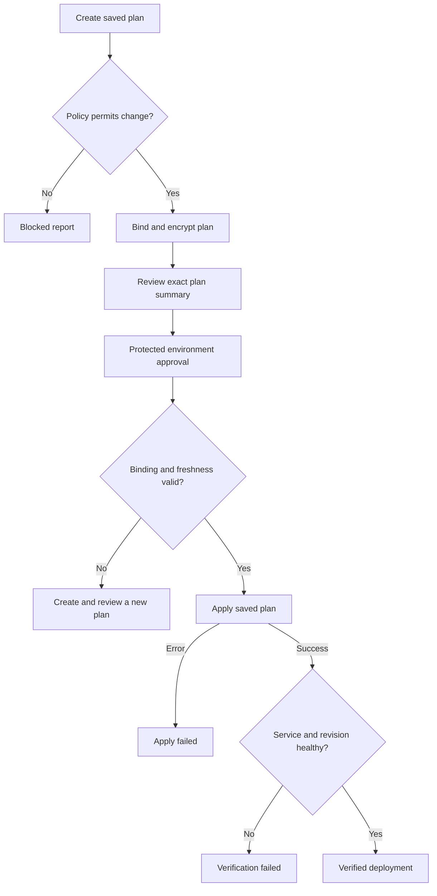

# Architecture and deployment contract

The CLI interprets plans, evaluates policy through OPA, binds artifacts, probes
services, and reports results. OpenTofu owns state and provisioning. GitHub Actions
or Spacelift owns scheduling, credentials, and approval. Assign one controller per
state. A report is not an authorization token.

## Decisions

- **Standard-library Python:** Python 3.11+ provides TOML, JSON, hashing, subprocess
  isolation, and HTTP clients. The core package has no runtime pip dependencies.
- **Rego as the single policy implementation:** rules ship inside the wheel and
  container. Adapters call that bundle rather than implementing parallel Python rules.
- **Private raw inputs, limited outputs:** plans and outputs stay on the trusted
  runner. Reports contain resource metadata and fixed outcomes, not attribute values.
- **Process deadlines:** each HTTP probe is a separate process so slow DNS or a
  server trickling response bytes cannot block verification indefinitely. A check
  deadline includes process startup. Checks execute sequentially; the maximum total
  duration is approximately the sum of configured deadlines plus small overhead.
- **No generic rollback:** successful resources may remain after a partial apply.
  A failed health check may require an application roll-forward or a newly reviewed
  infrastructure plan. Restoring a state backup does not undo cloud changes.
- **Integration first:** the composite GitHub Action handles review of an existing
  runner-local plan. The manual AWS workflow demonstrates the complete lifecycle.

## Trust and integrity

The binding contains hashes of the binary plan, provider lockfile, toolkit config,
and optional backend/account context, plus the source commit, OpenTofu version,
environment, and creation time. A plan expires after one hour by default. Altering
any bound input invalidates it. These hashes depend on trusted CI and artifact
transport; they are not signatures or independent proof of provenance.

The public-admin policy is explicitly scoped to supported AWS security group
resources. IAM analysis, route reachability, resource discovery outside state, and
organization-wide compliance are separate concerns.

## Report states

| State | Meaning |
| --- | --- |
| blocked | Policy rejected the plan. |
| reviewed | Policy passed; no apply result was supplied. |
| apply_failed | OpenTofu apply failed; some changes may already exist. |
| unverified | Apply succeeded but complete verification evidence is absent. |
| verification_failed | Apply succeeded; at least one required service check failed. |
| verified | Apply succeeded and every configured service check passed. |

Exit codes: 0 for successful review/verification, 1 for policy or deployment failure,
2 for invalid input or a tool error. Shell adapters must preserve nonzero outcomes.
